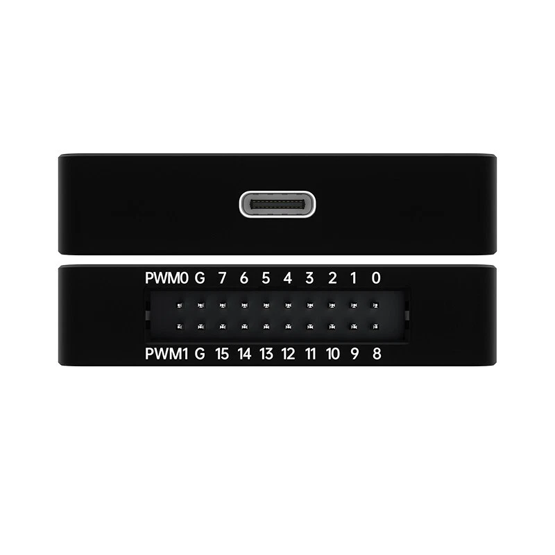
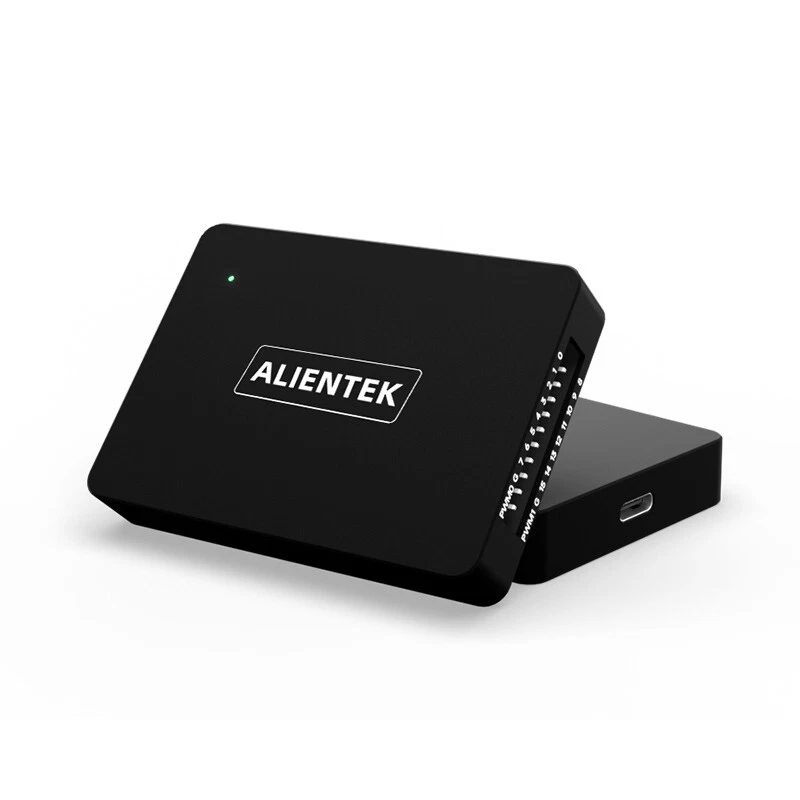
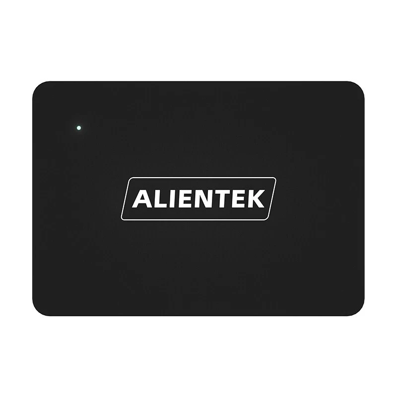

# ALIENTEK DL16 Plus · sigrok + PulseView

A native [libsigrok](https://sigrok.org/) hardware driver that adds full
**ALIENTEK DL16 / DL16 Plus** logic analyzer support to **sigrok-cli** and
**PulseView**.

This is a fork of [sigrok-project/libsigrok](https://github.com/sigrokproject/libsigrok)
with one addition: the `alientek-dl16` driver. The device protocol was
reverse-engineered from ALIENTEK's GPL "ATK-Logic" host software and
reimplemented cleanly for upstreaming.

<p align="center">
  
  
  
</p>

<div align="center">

| | |
|---|---|
| **Device** | ALIENTEK DL16 / DL16 Plus (16-channel logic analyzer) |
| **USB ID** | `1a86:ffcc` |
| **License** | GPL v3 or later |
| **Upstream** | [sigrok-project/libsigrok](https://github.com/sigrokproject/libsigrok) |

</div>

---

## ✨ Features

| Feature | Details |
|---------|---------|
| **16 logic channels** | `D0` … `D15` |
| **Sample rates** | 1–500 MHz (buffer mode) · 1–20 MHz (stream mode, 16ch) |
| **Capture modes** | Stream · Buffer · RLE |
| **Trigger** | Rising / Falling / High / Low / Any-edge, with buffer-mode trigger crop |
| **Threshold** | −5 V … +5 V, 0.1 V steps |
| **PWM output** | 2 channels, 1 Hz … 20 MHz |
| **Model detection** | Auto-detects "DL16" vs "DL16 Plus" |
| **Version gate** | Refuses to open devices below FPGA firmware 1.15 |

## 🔌 Hardware

| Parameter | DL16 | DL16 Plus |
|-----------|------|-----------|
| Channels | 16 | 16 |
| Max rate (buffer) | 250 MHz (16ch) · 100 MHz (3ch) | 1 GHz (8ch) · 500 MHz (16ch) · 100 MHz (3ch) |
| Max rate (stream) | 20 MHz (16ch) · 50 MHz (6ch) · 100 MHz (3ch) | same |
| Storage depth | 1 Gbit | 3.5 Gbit |
| Min pulse width | 8 ns | 2 ns |
| Input voltage | −40 V … +40 V | same |
| Input impedance | 250 kΩ / 15 pF | same |

## 📦 Status

| Platform | Status |
|----------|--------|
| **Linux** | ✅ Verified — `sigrok-cli` + PulseView, live capture decodes UART, trigger/RLE/PWM exercised |
| **Windows** | 🚧 Cross-compile in progress (MXE); release binaries will be attached |

## 📦 Dependencies (Linux)

Copy-paste to install everything needed (Debian/Ubuntu):

```sh
sudo apt-get update && sudo apt-get install -y \
  git build-essential autoconf automake libtool pkg-config \
  libglib2.0-dev libusb-1.0-0-dev libzip-dev \
  libftdi1-dev libhidapi-dev libserialport-dev
```

> Minimal DL16-only build only needs `libglib2.0-dev` and `libusb-1.0-0-dev`
> (plus the toolchain). The extra packages enable the other libsigrok drivers.

## 🛠️ Building (Linux)

```sh
git clone https://github.com/CapnRon/alientek-dl16-sigrok-pulseview.git
cd alientek-dl16-sigrok-pulseview
chmod +x autogen.sh   # required if the script isn't executable
./autogen.sh
make
sudo make install
sudo ldconfig          # required: refresh the loader cache so tools pick up the new library
```

Choose **one** `./configure` line before running `make`:

**Full build (recommended)** — all drivers + `alientek-dl16` + C++ bindings (required for PulseView):

```sh
./configure --enable-cxx --disable-python --disable-java --disable-ruby --prefix=/usr/local
```

**Minimal build** — `alientek-dl16` only (fastest; `sigrok-cli` works, but PulseView will NOT see the driver):

```sh
./configure --disable-all-drivers --enable-alientek-dl16
```

## 📟 Usage

```sh
# Enumerate devices
sigrok-cli --scan
# → alientek-dl16 - ALIENTEK DL16 Plus with 16 channels: D0 … D15

# Capture channel 0 at 1 MHz
sigrok-cli -d alientek-dl16 -c samplerate=1m \
    --channels=D0 --samples=1M -O binary -o capture.bin

# Buffer-mode capture with a rising-edge trigger on D0
sigrok-cli -d alientek-dl16 -c samplerate=10m -c continuous=false \
    --channels=D0 --triggers D0=r --samples=100k -O binary -o trig.bin
```

In **PulseView**: the device appears under *Devices → ALIENTEK DL16 Plus* once
the driver is installed.

### Config keys

`SR_CONF_SAMPLERATE`, `SR_CONF_LIMIT_SAMPLES`, `SR_CONF_LIMIT_FRAMES`,
`SR_CONF_CAPTURE_RATIO`, `SR_CONF_RLE`, `SR_CONF_CONTINUOUS`,
`SR_CONF_VOLTAGE_THRESHOLD`, `SR_CONF_TRIGGER_MATCH`,
`SR_CONF_OUTPUT_FREQUENCY`, `SR_CONF_DUTY_CYCLE`.

## 🚀 Upstreaming

The driver is a clean **10-commit series** (DCO signed-off) based on upstream
`master`, intended for submission as a pull request to
`sigrok-project/libsigrok`. See:

```sh
git log master -- src/hardware/alientek-dl16
```

## 📁 Driver files

```
src/hardware/alientek-dl16/
├── api.c        # scan / open / close, config keys
├── protocol.c   # USB framing, CRC, capture, data transpose
└── protocol.h   # constants, device context
```

## 📄 License

GPL v3 or later — same as libsigrok.

---


## Original upstream README (unchanged)

```text
-------------------------------------------------------------------------------
README
-------------------------------------------------------------------------------

The sigrok project aims at creating a portable, cross-platform,
Free/Libre/Open-Source signal analysis software suite that supports various
device types (such as logic analyzers, oscilloscopes, multimeters, and more).

libsigrok is a shared library written in C which provides the basic API
for talking to hardware and reading/writing the acquired data into various
input/output file formats.


Status
------

libsigrok is in a usable state and has had official tarball releases.

While the API can change from release to release, this will always be
properly documented and reflected in the package version number and
in the shared library / libtool / .so-file version numbers.

However, there are _NO_ guarantees at all for stable APIs in git snapshots!
Distro packagers should only use released tarballs (no git snapshots).


Requirements
------------

Requirements for the C library:

 - git (only needed when building from git)
 - gcc (>= 4.0) or clang
 - make
 - autoconf >= 2.63 (only needed when building from git)
 - automake >= 1.11 (only needed when building from git)
 - libtool (only needed when building from git)
 - pkg-config >= 0.22
 - libglib >= 2.32.0
 - zlib (optional, used for CRC32 calculation in STF input)
 - libzip >= 0.11
 - libtirpc (optional, used by VXI, fallback when glibc >= 2.26)
 - libserialport >= 0.1.1 (optional, used by some drivers)
 - librevisa >= 0.0.20130412 (optional, used by some drivers)
 - libusb-1.0 >= 1.0.16 (optional, used by some drivers)
 - hidapi >= 0.8.0 (optional, used for some HID based "serial cables")
 - bluez/libbluetooth >= 4.0 (optional, used for Bluetooth/BLE communication)
 - libftdi1 >= 1.0 (optional, used by some drivers)
 - libgpib (optional, used by some drivers)
 - libieee1284 (optional, used by some drivers)
 - libgio >= 2.32.0 (optional, used by some drivers)
 - nettle (optional, used by some drivers)
 - check >= 0.9.4 (optional, only needed to run unit tests)
 - doxygen (optional, only needed for the C API docs)
 - graphviz (optional, only needed for the C API docs)

Requirements for the C++ bindings:

 - libsigrok >= 0.4.0 (the libsigrok C library, see above)
 - A C++ compiler with C++11 support (-std=c++11 option), e.g.
   - g++ (>= 4.8.1)
   - clang++ (>= 3.3)
 - autoconf-archive (only needed when building from git)
 - doxygen (required for building the bindings, not only for C++ API docs!)
 - graphviz (optional, only needed for the C++ API docs)
 - Python 3 executable (development files are not needed)
 - glibmm-2.4 (>= 2.32.0) or glibmm-2.68 (>= 2.68.0)

Requirements for the Python bindings:

 - libsigrokcxx >= 0.4.0 (the libsigrok C++ bindings, see above)
 - SWIG >= 2.0.0
 - Python >= 3 (including development files!)
 - Python setuptools
 - pygobject >= 3.0.0, a.k.a python-gi
 - numpy
 - doxygen (optional, only needed for the Python API docs)
 - graphviz (optional, only needed for the Python API docs)
 - doxypy (optional, only needed for the Python API docs)

Requirements for the Ruby bindings:

 - libsigrokcxx >= 0.4.0 (the libsigrok C++ bindings, see above)
 - Ruby >= 2.5.0 (including development files!)
 - SWIG >= 3.0.8
 - YARD (optional, only needed for the Ruby API docs)

Requirements for the Java bindings:

 - libsigrokcxx >= 0.4.0 (the libsigrok C++ bindings, see above)
 - SWIG >= 2.0.0
 - Java JDK (for JNI includes and the javac/jar binaries)
 - doxygen (optional, only needed for the Java API docs)
 - graphviz (optional, only needed for the Java API docs)


Building and installing
-----------------------

In order to get the libsigrok source code and build it, run:

 $ git clone git://sigrok.org/libsigrok
 $ cd libsigrok
 $ ./autogen.sh
 $ ./configure
 $ make

For installing libsigrok:

 $ make install

See INSTALL or the following wiki page for more (OS-specific) instructions:

 http://sigrok.org/wiki/Building

Please also check the following wiki page in case you encounter any issues:

 http://sigrok.org/wiki/Building#FAQ


Device-specific issues
----------------------

Please check README.devices for some notes and hints about device- or
driver-specific issues to be aware of.


Firmware
--------

Some devices supported by libsigrok need a firmware to be uploaded before the
device can be used. See README.devices for details.


Copyright and license
---------------------

libsigrok is licensed under the terms of the GNU General Public License
(GPL), version 3 or later.

While some individual source code files are licensed under the GPLv2+, and
some files are licensed under the GPLv3+, this doesn't change the fact that
the library as a whole is licensed under the terms of the GPLv3+.

Please see the individual source files for the full list of copyright holders.


Mailing list
------------

 https://lists.sourceforge.net/lists/listinfo/sigrok-devel


IRC
---

You can find the sigrok developers in the #sigrok IRC channel on Libera.Chat.


Website
-------

 http://sigrok.org/wiki/Libsigrok

```
